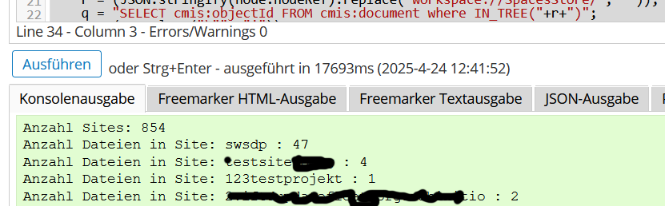

# alfresco-helper
## several Alfresco-helper-Files
### copySites.py  
#### Zweck:
übertrage von einem alten Alfresco-Server die Sites und Ihre Sitemanager auf einen neuen Alfresco-Server.  
Es werden nur die Sites angelegt und berechtigt.  
Es werden noch keine Dateien kopiert.
#### Voraussetzungen:  
beide Alfresco-Server sind gleichwertig konfiguriert.  
auf beiden Server sind die selben Benutzer angelegt.  
Bei LDAP-Authentifizierung müssen die Benutzer sich auf dem neuen Server einmalig angemeldet haben  
damit das Benutzerobjekt in der Datenbank angelegt wurde.  
Die Variablen "mysrcsrv", "mysrcauth", "mydestsrv", "mydestauth" müssen vorher mit den eigenen Werten angepasst werden.  
Backup/Snapshot vorher durchführen.
#### Ausführung:
  python3 copySites.py
#### Erfahrungen:
Alfresco 4.1 -> Alfresco 23.4.1 mit über 800 Sites  
Dauer: ca. 1h

### copySitesUsers.py  
#### Zweck:
übertrage von einem alten Alfresco-Server die Site-Benutzer und Ihre Rechte auf einen neuen Alfresco-Server.  
Es werden noch keine Dateien kopiert.
#### Voraussetzungen:  
beide Alfresco-Server sind gleichwertig konfiguriert.  
auf beiden Server sind die selben Benutzer angelegt.  
Die Variablen "mysrcsrv", "mysrcauth", "mydestsrv", "mydestauth" müssen vorher mit den eigenen Werten angepasst werden.  
Backup/Snapshot vorher durchführen.
#### Ausführung:
  python3 copySitesUsers.py
#### Erfahrungen:
Alfresco 4.1 -> Alfresco 23.4.1 mit über 800 Sites  
Dauer: ca. 30 min
### js_List_Sites_and_Files.js
#### Zweck:
Zeige alle Seiten und die Anzahl ihrer jeweiligen Dateien an.
#### Ausführung:
in Alfresco:
https://myalfresco.my.dom.ain/share/page/console/admin-console/javascript-console

### chguserpw:
#### Zweck:
resette als admin das (vergessene) Passwort eines Benutzers
